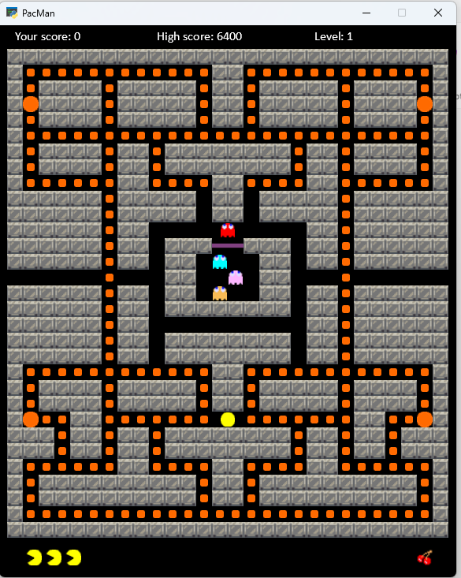
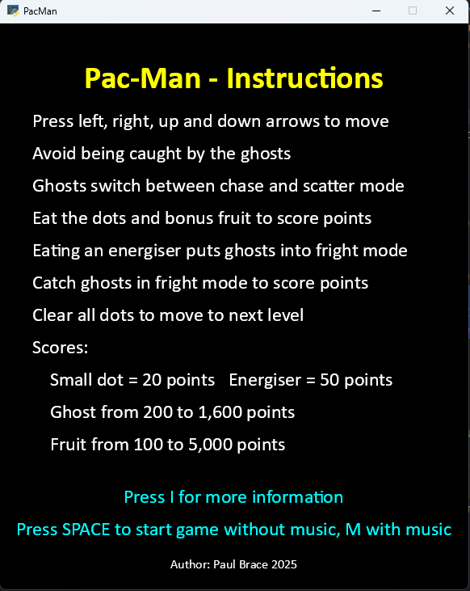
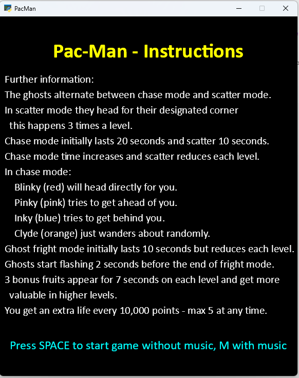

# PacMan
 Pac-Man game written in Python using the Arcade library

I originally wrote this and 3 other retro games in JavaScript for my grandchildren.

If you are interested the site is here http://brace.great-site.net 

    Author Paul Brace
    paul.brace@gmail.com
    March 2025